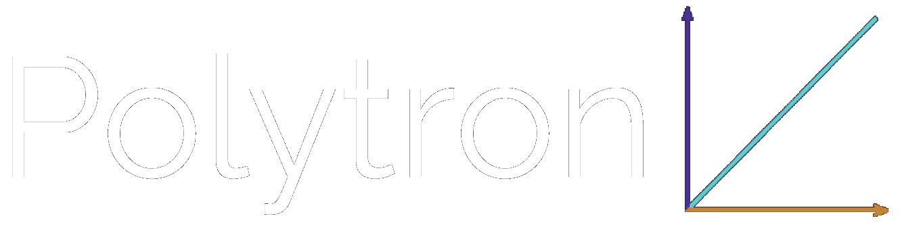

 

  

  

       
    Aplicatie pentru explicarea si aplicarea notiunilor matematice in informatica
     
    Proiect creat pe perioada concursului UBB Hermes Hackathon 2021. Locul 3.
    

 
 
 

# Cuprins
  <ol>
    <li>
      <a href="#despre-aplicatie">Despre aplicatie</a>
      <ul>
        <li><a href="#librarii-folosite">Librarii folosite</a></li>
      </ul>
    </li>
    <li>
      <a href="#getting-started">Getting Started</a>
      <ul>
        <li><a href="#prerequisites">Prerequisites</a></li>
        <li><a href="#installation">Installation</a></li>
      </ul>
    </li>
    <li><a href="#screenshot">Screenshots</a></li>
  </ol>
  
  
  

# Despre aplicatie
• Ce este Polytron?

Este o aplicatie open-source care are ca scop sa ajute elevii de liceu si programatorii incepatori sa inteleaga notiuniile complicate din matematica prin reprezentarea lor in mod vizual si a arata cum poate fi matematica folosita in programarea grafica

• De ce am creat aplicatia?

Sa invete utilizatorul matematica prin prezentarea vizuala a acesteia

Sa arate exemple reale in care se foloseste matematica prin aplicarea sa in program 

| Version | `1.0`    |
| :-----: | :---     |
| IDE     | `Visual Studio 2019 sau mai nou` |
| Platform | `Win32` |

 

## Librarii folosite

in afara de C++ am folosit openGL cu ajutorul acestor librarii:

* [glfw](https://www.glfw.org/)
* [glew](http://glew.sourceforge.net/)
* [stb_image](https://github.com/nothings/stb)
* [glm](https://github.com/g-truc/glm)
* [Dear ImGui](https://github.com/ocornut/imgui)

# Screenshot

